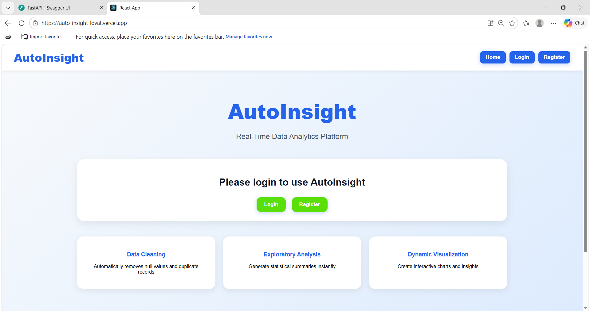
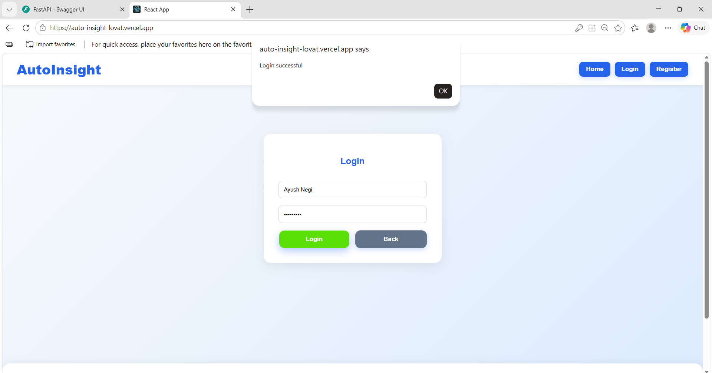
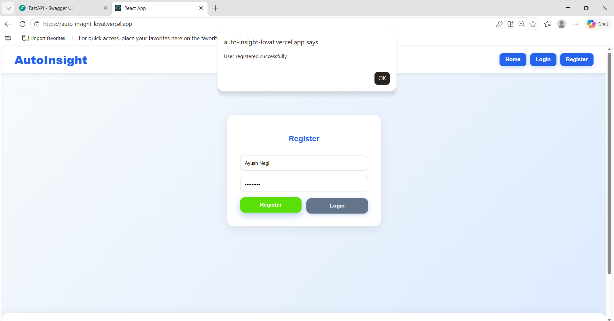
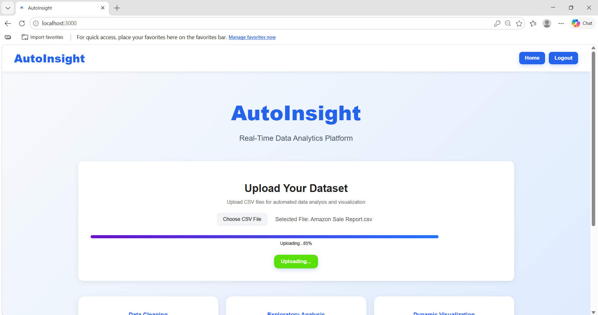
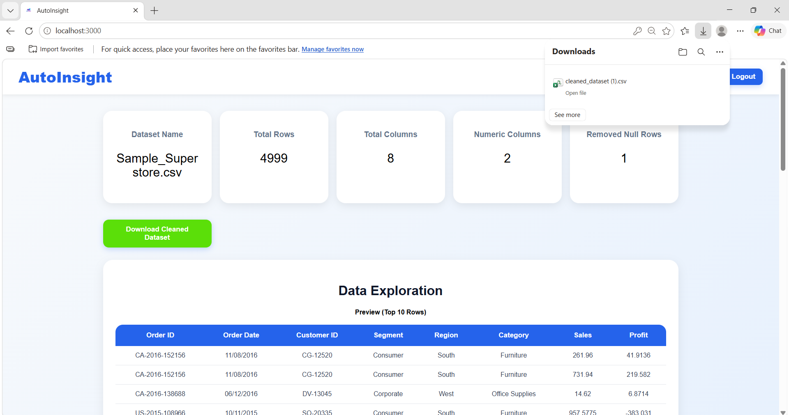
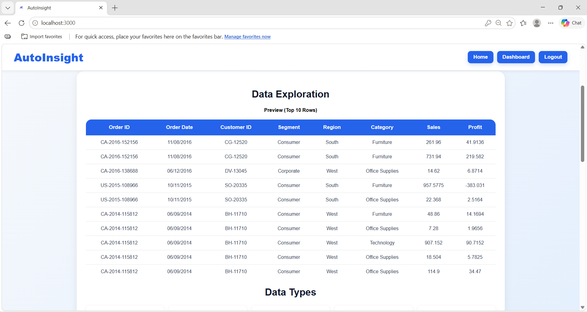
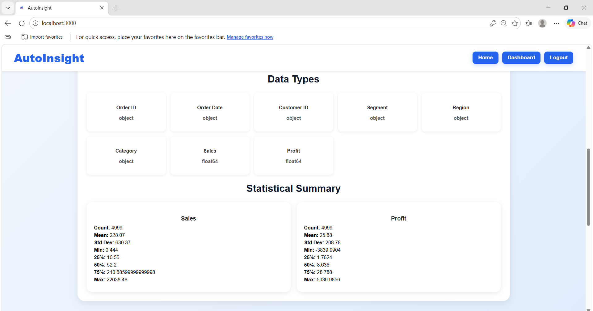
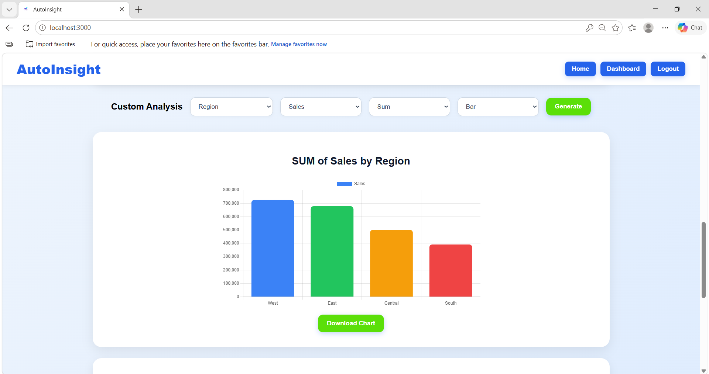
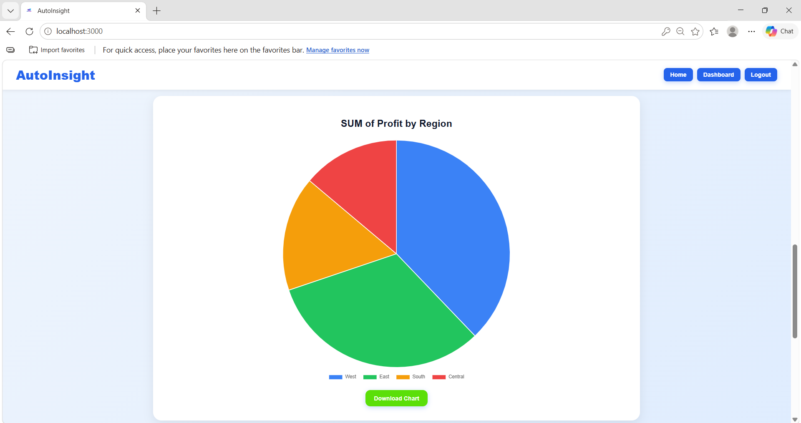
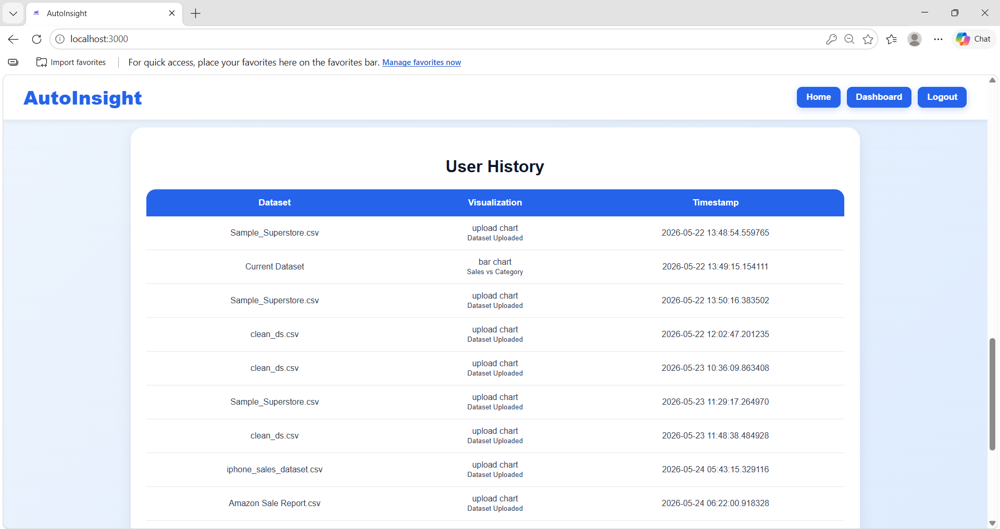

# AutoInsight – Real-Time Data Analytics Platform

AutoInsight is a full-stack real-time data analytics platform that allows users to upload CSV datasets, perform automated data cleaning, explore datasets, generate custom visualizations, and track analytics history through an interactive dashboard.

---

# Features

- User Authentication (Login/Register)
- CSV Dataset Upload
- Upload Progress Bar
- Automated Data Cleaning
- Exploratory Data Analysis (EDA)
- Statistical Summary Generation
- Interactive Chart Visualization
- Custom Chart Generation
- Dataset History Tracking
- Responsive UI
- Full-Stack Deployment

---

# Tech Stack

## Frontend
- React.js
- CSS
- Recharts
- JavaScript

## Backend
- FastAPI
- Pandas
- NumPy
- SQLAlchemy

## Database
- PostgreSQL / Supabase

## Deployment
- Vercel (Frontend)
- Render (Backend)

---

# Project Structure

```bash
AutoInsight/
│
├── assets/
│   └── screenshots/
│
├── backend/
│   │
│   ├── app/
│   │   │
│   │   ├── db/
│   │   │   ├── database.py
│   │   │   └── models.py
│   │   │
│   │   ├── routes/
│   │   │   ├── upload.py
│   │   │   └── auth.py
│   │   │
│   │   ├── services/
│   │   │   └── cleaning.py
│   │   │
│   │   └── main.py
│   │
│   └── requirements.txt
│
├── frontend/
│   │
│   │
│   └── src/
│       │
│       ├── components/
│       │   ├── ChartResult.jsx
│       │   ├── CustomAnalysis.jsx
│       │   ├── DataExploration.jsx
│       │   ├── DatasetOverview.jsx
│       │   ├── FeatureCards.jsx
│       │   ├── Footer.jsx
│       │   ├── History.jsx
│       │   ├── Index.jsx
│       │   ├── Login.jsx
│       │   ├── Navbar.jsx
│       │   ├── Register.jsx
│       │   ├── Spinner.jsx
│       │   └── UploadSection.jsx
│       │
│       ├── configuration/
│       │   └── api.js
│       │
│       ├── services/
│       │   ├── chartservice.js
│       │   └── index.js
│       │
│       ├── styles/
│       │   ├── analysis.css
│       │   ├── authentication.css
│       │   ├── cards.css
│       │   ├── features.css
│       │   ├── global.css
│       │   ├── hero.css
│       │   ├── index.css
│       │   ├── navbar.css
│       │   ├── spinner.css
│       │   ├── tables.css
│       │   └── upload.css
│       │
│       ├── App.js
│       ├── App.test.js
│       ├── index.css
│       └── index.js
│
└── README.md

```

---

# Screenshots

## Home Page



---

## Login Page



---

## Register Page



---

## Dataset Upload



---

## Download Cleaned Dataset



---

## Data Exploration



---

## Statistical Summary



---

## Custom Chart Generation




---

## History Section



---

# Installation

## Clone Repository

```bash
git clone https://github.com/your-username/auto_insight.git
```

---

# Backend Setup

```bash
cd backend
pip install -r requirements.txt
uvicorn app.main:app --reload
```

Backend runs on:

```bash
http://127.0.0.1:8000
```

---

# Frontend Setup

```bash
cd frontend
npm install
npm start
```

Frontend runs on:

```bash
http://localhost:3000
```

---

# API Endpoints

| Method | Endpoint | Description |
|---|---|---|
| POST | `/register` | Register user |
| POST | `/login` | User login |
| POST | `/upload` | Upload dataset |
| POST | `/custom-chart` | Generate charts |
| GET | `/history/{user_id}` | Fetch history |

---

# Dataset Processing

AutoInsight processes datasets by:

- Removing duplicate rows
- Handling missing values
- Detecting numeric columns
- Generating statistical summaries
- Creating custom visulisation

For performance optimization, large datasets are processed using a fixed row limit.

---

# Future Improvements

- Dashboard Persistence
- Advanced Chart Customization
- Download Reports
- AI-Based Insights
- Real-Time Collaboration
- Background Processing
- Pagination for Large Datasets
- Cloud Storage Integration

---

# Deployment Links

## Backend
Render - https://autoinsight-api-ihum.onrender.com

## Frontend
Vercel - https://auto-insight-lovat.vercel.app/

---

# Author

Ayush Negi
BCA Final Year Project